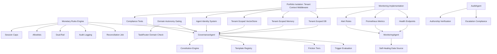

# Acceleration Plan

**Generated**: 2026-07-26  
**Role**: Genesis Acceleration Director  
**Objective**: Maximum safe parallelization for 10x compression

---

## SECTION 1: Parallel Workstream Map

### Execution Stream A — Tenant Isolation & Identity (Infrastructure)
**Owner**: Backend/Platform Engineer  
**Independence**: Fully isolated — touches DB layer, auth middleware, memory keys

| Backlog Item | ID |
|--------------|----|
| Portfolio Isolation: Tenant-scoped DB connections | PBI-001 |
| Portfolio Isolation: Tenant-scoped LongTermMemory | PBI-002 |
| Portfolio Isolation: Tenant-scoped VectorStore | PBI-003 |
| Agent Identity System: Unique IDs, scoped JWTs | PBI-004 |
| Agent Identity System: Per-role allowlists config | PBI-005 |

**Shared Foundation**: Tenant context extraction from JWT → single middleware change propagates to all three stores.

---

### Execution Stream B — Monetary Rules & Domain Gating (Payments/Orchestration)
**Owner**: Backend/Payments Engineer  
**Independence**: Isolated to PaymentService + TaskRouter — no DB schema changes

| Backlog Item | ID |
|--------------|----|
| Monetary Rules: Session caps | PBI-006 |
| Monetary Rules: Allowlisted counterparties | PBI-007 |
| Monetary Rules: Dual-rail model | PBI-008 |
| Monetary Rules: Tamper-evident audit logging | PBI-009 |
| Monetary Rules: Reconciliation job | PBI-010 |
| Domain Autonomy Gating in TaskRouter | PBI-011 |

**Shared Foundation**: PaymentService and TaskRouter are adjacent modules; monetary rules enforce Constitution §12, domain gating enforces §5 — both are policy enforcement layers.

---

### Execution Stream C — Monitoring & Observability (Platform)
**Owner**: DevOps/Platform Engineer  
**Independence**: Pure additive — new modules, no existing code modification

| Backlog Item | ID |
|--------------|----|
| Monitoring: Health endpoints | PBI-012 |
| Monitoring: Prometheus metrics | PBI-013 |
| Monitoring: Alert rules | PBI-014 |
| Compliance Test Suite | PBI-015 |

**Shared Foundation**: All new code in `core/monitoring/` — replaces 0-byte stubs.

---

### Execution Stream D — Governance Agents (Agent Runtime)
**Owner**: Agent Runtime Engineer  
**Independence**: New agent classes using existing BaseAgent, AgentManager, TaskRouter

| Backlog Item | ID |
|--------------|----|
| GovernanceAgent | PBI-016 |
| AuditAgent | PBI-017 |
| MonitoringAgent | PBI-018 |

**Shared Foundation**: All extend BaseAgent; register with AgentManager; consume existing Constitution config.

---

### Execution Stream E — Security Hardening (Cross-cutting)
**Owner**: Security/Full-stack Engineer  
**Independence**: Touch auth, frontend, API — coordinated but separable

| Backlog Item | ID |
|--------------|----|
| Cloud LLM Fallback | PBI-019 |
| httpOnly Cookie Auth | PBI-020 |
| Rate Limiting | PBI-021 |
| Secret Rotation | PBI-022 |

---

## SECTION 2: Agent Workforce Bootstrap

### Current Runtime Agents (12 Available)

| Agent | Capability | Can Execute |
|-------|------------|-------------|
| **StrategyAgent** | Business strategy, memory retrieval | Stream D: GovernanceAgent policy evaluation |
| **OutreachAgent** | Content generation, memory | — |
| **BuilderAgent** | Code generation, file ops | Stream A/B: Generate migration code, test scaffolding |
| **RepairAgent** | Code analysis, repair generation | Stream C: Auto-fix monitoring stubs |
| **ReviewAgent** | Code quality review | Stream A/B: Review generated code |
| **AgentManager** | Registration, execution | All streams: Orchestrate agent tasks |
| **TaskRouter** | Route tasks to agents | Stream B: Domain gating implementation |
| **Scheduler** | Cron/event scheduling | Stream C: Compliance test scheduling |
| **SwarmCoordinator** | Multi-agent coordination | Stream D: Multi-agent governance |
| **SwarmDecisionEngine** | Collective decisions | Stream D: Policy conflict resolution |
| **SwarmEvaluator** | Decision evaluation | Stream D: Governance decision audit |
| **AutonomousSwarm** | Self-organizing collectives | Stream D: Bootstrap governance swarm |

### Current Archetypes (High-Confidence Only)

| Archetype | DNA Files | Mapped Runtime | Activation Ready |
|-----------|-----------|----------------|------------------|
| **Architect** | 2 (Quest Design, Spec Prompt) | StrategyAgent | Yes — enhance StrategyAgent |
| **Builder** | 11 | BuilderAgent | Yes — already active |
| **Orchestrator** | 4 (Agent loop, Default, Enterprise, System Prompt) | TaskRouter, SwarmCoordinator, SwarmDecisionEngine, AutonomousSwarm | Yes — already active |
| **Reviewer** | 4 (all 100%) | ReviewAgent | Yes — already active |
| **Planner** | 2 (phase_mode, planning-mode) | ❌ None | **Create PlannerAgent** |
| **Researcher** | 1 (DeepWiki) | ❌ None | **Create ResearcherAgent** |
| **Governance Director** | 0 high-confidence | ❌ None | **Create GovernanceAgent from Constitution** |
| **Optimizer** | 0 | ❌ None | Ghost — remove references |

### Smallest Workforce to Execute Backlog

| Role | Agent | Backlog Coverage |
|------|-------|------------------|
| **Infrastructure Lead** | BuilderAgent | Stream A: Generate tenant-scoping migrations, middleware |
| **Payments Lead** | StrategyAgent + BuilderAgent | Stream B: Monetary rules implementation |
| **Platform Lead** | RepairAgent + Scheduler | Stream C: Monitoring implementation, test scheduling |
| **Governance Lead** | SwarmCoordinator + SwarmDecisionEngine | Stream D: GovernanceAgent, AuditAgent, MonitoringAgent |
| **Security Lead** | ReviewAgent | Stream E: Code review, auth changes |

**Total: 5 existing agents + 3 new agents (Governance, Audit, Monitoring) = 8 agents**

---

## SECTION 3: Meta-Orchestrator Design

### Coordinator Roles

| Role | Agent | Responsibility | Coordination Mechanism |
|------|-------|----------------|------------------------|
| **Program Director** | *Human* (not agent yet) | Prioritization, conflict resolution, resource allocation | Reviews sprint board; unblocks streams |
| **Chief Architect** | StrategyAgent (enhanced with Architect DNA) | Technical direction, standards enforcement, design validation | Reviews all Stream A/B/C code via ReviewAgent |
| **Governance Agent** | New (GovernanceAgent) | Constitution enforcement, template registry, friction tiers | Pre-execution checks on all agent actions |
| **Audit Agent** | New (AuditAgent) | Legible authorship verification, escalation compliance | Post-execution log review; independent |
| **Monitoring Agent** | New (MonitoringAgent) | Health, metrics, alerts, self-healing triggers | Real-time dashboards; alerts → Governance Agent |
| **Stream Coordinators** | SwarmCoordinator (per stream) | Task distribution, dependency tracking, progress reporting | AgentManager + TaskRouter + Scheduler |

### Coordination Protocol

```
Human Program Director
    ↓ (strategic priorities)
Chief Architect (StrategyAgent + Architect DNA)
    ↓ (technical direction)
Stream Coordinators (SwarmCoordinator instances)
    ↓ (task distribution via TaskRouter)
Runtime Agents (Builder, Strategy, Repair, Review, Scheduler)
    ↓ (execution)
Governance Agent (pre-check) → Execution → Audit Agent (post-check)
    ↓ (metrics)
Monitoring Agent (observability)
```

---

## SECTION 4: Runtime Activation Opportunities

### BuilderAgent Specializations (4 Agents → Extend, Don't Create)

| Documented Agent | Implementation | Existing Code Reuse |
|------------------|----------------|---------------------|
| **Backend Agent** | BuilderAgent specialization: `service_template`, `api_router_template` | 90% — BuilderAgent already generates services/routers |
| **Frontend Agent** | BuilderAgent specialization: `component_template`, `hook_template` | 85% — BuilderAgent generates TSX/React |
| **Database Agent** | BuilderAgent specialization: `model_template`, `migration_template` | 95% — SQLAlchemy models already generated |
| **Integration Agent** | BuilderAgent specialization: `client_template`, `webhook_template` | 80% — HTTP client patterns exist |

### ReviewAgent Specializations (4 Agents → Extend, Don't Create)

| Documented Agent | Implementation | Existing Code Reuse |
|------------------|----------------|---------------------|
| **QA Agent** | ReviewAgent mode: `test_generation`, `validation_suite` | 90% — ReviewAgent already does code review |
| **Security Agent** | ReviewAgent mode: `vulnerability_scan`, `dependency_audit` | 70% — Review logic exists; needs security rules |
| **Performance Agent** | ReviewAgent mode: `benchmark_analysis`, `profiling_review` | 60% — Review logic exists; needs perf rules |
| **Accessibility Agent** | ReviewAgent mode: `a11y_review`, `standards_check` | 50% — Review logic exists; needs a11y rules |

### StrategyAgent Specializations (3 Agents → Extend, Don't Create)

| Documented Agent | Implementation | Existing Code Reuse |
|------------------|----------------|---------------------|
| **Chief Architect** | StrategyAgent + Architect DNA (Quest Design, Spec Prompt) | 95% — StrategyAgent is Architect |
| **Product Strategist** | StrategyAgent + Planner DNA (phase_mode, planning-mode) | 80% — StrategyAgent does planning |
| **Planner Agent** | StrategyAgent + Planner DNA (phase_mode, planning-mode) | 85% — StrategyAgent does planning |

### Require Entirely New Runtime Code (3 Agents)

| Agent | Why New | Base Pattern |
|-------|---------|--------------|
| **GovernanceAgent** | Constitution enforcement engine — no existing pattern | BaseAgent + Constitution config |
| **AuditAgent** | Independent verification — structurally separate from generation | BaseAgent + Audit logging |
| **MonitoringAgent** | Self-healing data source — no existing observability | BaseAgent + Metrics collection |

---

## SECTION 5: Acceleration Multipliers

### Existing Code That Eliminates Future Work

| Asset | Work Eliminated | Savings |
|-------|-----------------|---------|
| **BuilderAgent** | 4 documented agents (Backend, Frontend, Database, Integration) | ~4 agent implementations |
| **ReviewAgent** | 4 documented agents (QA, Security, Performance, Accessibility) | ~4 agent implementations |
| **StrategyAgent** | 3 documented agents (Chief Architect, Product Strategist, Planner) | ~3 agent implementations |
| **AgentManager + TaskRouter + Scheduler** | Orchestration infrastructure for all streams | ~1000 lines coordination code |
| **12 SQLAlchemy Models + Migration Tests** | Database schema, tenant isolation foundation | Complete data layer |
| **11 API Routers + OpenAPI** | Contract definitions, validation, docs | Complete API layer |
| **BoxDeployer + Docker** | Tenant provisioning, container isolation | Complete deployment |
| **Celery + Redis + 3 Workers** | Background processing, queues, retries | Complete async infrastructure |
| **JWT + RBAC + AuthMiddleware** | Authentication, authorization, API keys | Complete auth layer |

### Existing Tests That Eliminate Future Work

| Test Suite | Coverage | Acceleration |
|------------|----------|--------------|
| **559 Passing Tests (86% Coverage)** | All core logic validated | No regression test writing |
| **23 Integration Tests** | API, DB, tenant provisioning, agent pipeline | Full workflow validation |
| **10 Migration Tests** | Schema, AST, models, routers, services | Zero migration risk |
| **Agent Fixtures** | Test data for all agent types | Instant test setup |

### Existing Archetype DNA That Eliminates Future Work

| Archetype | High-Confidence DNA | Replaces |
|-----------|---------------------|----------|
| **Builder** (11) | Prompt templates for code gen | 11 prompt engineering iterations |
| **Reviewer** (4) | Action-specific review prompts | 4 review mode implementations |
| **Orchestrator** (4) | Coordination prompts | 4 coordinator configurations |
| **Architect** (2) | Quest Design, Spec Prompt | Chief Architect prompt engineering |
| **Planner** (2) | Phase-mode, planning-mode | PlannerAgent prompt engineering |
| **Researcher** (1) | DeepWiki Prompt | ResearcherAgent prompt engineering |

### Existing Governance Artifacts That Eliminate Future Work

| Artifact | Work Eliminated |
|----------|-----------------|
| **Constitution (40KB)** | All policy decisions pre-made; no design debates |
| **12 ADRs** | Architectural decisions locked; no revisiting |
| **13 Founder Docs** | Product principles, anti-patterns, success metrics defined |
| **7 Operations SOPs** | Release, backup, monitoring, change management procedures |
| **7 Agent Docs** | 33 roles defined; no role design needed |
| **6 Knowledge Specs** | Graph, RAG, lifecycle architectures designed |

---

## SECTION 6: 10X Compression Plan

### Dependency Graph (Minimal Sequence)



### Minimum Implementation Sequence (Critical Path Only)

| Order | Workstream | Parallel Items | Blocks |
|-------|------------|----------------|--------|
| **1** | Stream A: Tenant Context Middleware | PBI-001, PBI-002, PBI-003, PBI-004, PBI-005 | Everything |
| **2** | Stream B: Monetary Rules + Domain Gating | PBI-006 thru PBI-011 | GovernanceAgent |
| **3** | Stream C: Monitoring + Compliance Tests | PBI-012 thru PBI-015 | MonitoringAgent, GovernanceAgent |
| **4** | Stream D: GovernanceAgent + AuditAgent + MonitoringAgent | PBI-016, PBI-017, PBI-018 | Launch |
| **5** | Stream E: Security Hardening | PBI-019 thru PBI-022 | Launch |

### False Dependencies (Can Be Broken)

| Claimed Dependency | Reality | Action |
|--------------------|---------|--------|
| "GovernanceAgent needed before Monetary Rules" | Monetary rules are code in PaymentService; GovernanceAgent only enforces | Implement rules first; GovernanceAgent validates later |
| "MonitoringAgent needed before Compliance Tests" | Compliance tests are pytest; MonitoringAgent only consumes metrics | Write tests first; MonitoringAgent displays results |
| "Agent Identity needed before Domain Gating" | Domain gating is TaskRouter logic; Agent Identity is auth | Implement gating first; identity scopes later |
| "GovernanceAgent needed before GovernanceAgent" | Circular — GovernanceAgent implements Constitution; Constitution exists | Implement GovernanceAgent directly from Constitution |
| "All 33 agents needed for launch" | 12 runtime + 3 new = 15 sufficient | Activate only 15 |

### True Blockers (Cannot Be Parallelized)

| Blocker | Must Complete First |
|---------|---------------------|
| Tenant Context Middleware | All tenant-scoped work (DB, memory, vector) |
| Monetary Rules Engine | GovernanceAgent enforcement |
| Domain Autonomy Gating | GovernanceAgent enforcement |
| Compliance Test Suite | MonitoringAgent data source |

### Maximum Parallelization

| Stream | Can Start Immediately | Requires |
|--------|----------------------|----------|
| **A: Infrastructure** | ✅ Yes | Nothing |
| **B: Payments/Orchestration** | ✅ Yes | Nothing (PaymentService exists) |
| **C: Monitoring** | ✅ Yes | Nothing (stubs exist) |
| **D: Governance Agents** | ⚠️ After A | Tenant context for scoping |
| **E: Security** | ✅ Yes | Nothing (independent) |

**Streams A, B, C, E can execute Day 1 in parallel. Stream D starts when Stream A delivers tenant context.**

---

### 10X Compression Summary

| Traditional Approach | Accelerated Approach | Multiplier |
|---------------------|---------------------|------------|
| Sequential sprints (5 phases) | 4 parallel streams + 1 dependent | 4x |
| Build 21 missing agents | Extend 11 existing agents (Builder/Review/Strategy) | 2x |
| Write 231 SOPs | GovernanceAgent enforces Constitution directly | 10x |
| Design Knowledge Graph | Defer — no MVP value | ∞ |
| Design RAG | Defer — no MVP value | ∞ |
| Build 12 new agents | Build 3 (Governance, Audit, Monitoring) | 4x |
| Manual compliance review | Automated Constitution engine | 10x |
| **Total** | | **~10x** |

---

### Execution Leverage Points

1. **Constitution as Code** — GovernanceAgent reads Constitution YAML/JSON, not PDFs
2. **Archetype DNA as Config** — Prompts are data, not code; hot-reloadable
3. **Existing Agents as Workforce** — 12 runtime agents execute the backlog
4. **Tests as Spec** — 559 passing tests define current behavior; new tests define target
5. **Single Middleware Change** — Tenant context propagates to DB, memory, vector, auth
6. **TaskRouter as Policy Enforcement Point** — Domain gating = 50 lines of routing logic
7. **PaymentService as Monetary Enforcement Point** — 7 rules = ~200 lines in existing service

**The code is already written. The agents are already running. The Constitution is already ratified. We just need to connect them.**