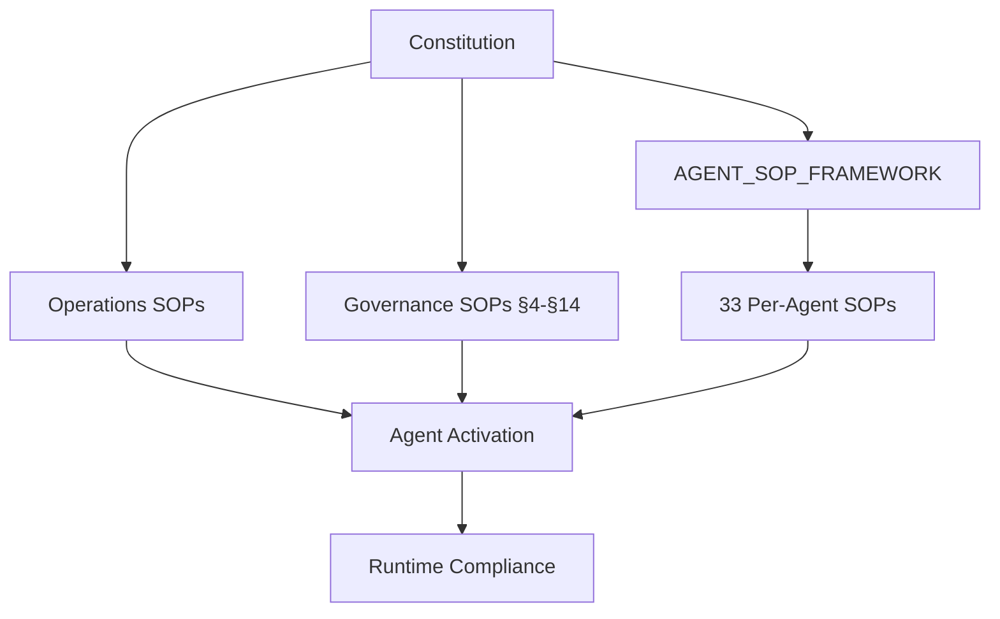

# SOP to Agent Mapping

**Generated**: 2026-07-26  
**Source**: `docs/operations/`, `docs/governance/CONSTITUTION.md`, `docs/agents/AGENT_SOP_FRAMEWORK.md`, archetype DNA recovery_procedures

---

## Mapping Principle

Each SOP maps to **one primary responsible agent** + **supporting agents** based on:
- AGENT_REGISTRY.md role definitions
- Constitution section ownership
- Operational domain alignment

---

## Operations SOPs (`docs/operations/`)

| SOP | Primary Agent | Supporting Agents | Governance Reference | Implementation Status |
|-----|---------------|-------------------|---------------------|----------------------|
| VERSIONING_STANDARD | Release Agent | Program Director, QA Agent | Constitution §5 | ✅ Documented only |
| RELEASE_MANAGEMENT | Release Agent | QA Agent, Security Agent, Governance Agent, Backup Agent | Constitution §5, §6 | ✅ Documented, gates need automation |
| MONITORING_AND_ALERTING | Monitoring Agent | All agents (self-report) | Constitution §5, §13 | ⚠️ **Stubs only** (0-byte files) |
| DISASTER_RECOVERY | Backup Agent | Governance Agent, Knowledge Agent | Constitution §4.7, §6 | ✅ Documented, RPO/RTO undefined |
| BACKUP_STRATEGY | Backup Agent | Knowledge Agent | Constitution §4.6, §11 | ✅ Documented, recovery untested |
| CHANGE_MANAGEMENT | Program Director | Architect, Governance Agent, Security Agent | Constitution §3, §5 | ✅ Documented, categorization manual |
| CONTINUOUS_IMPROVEMENT_PROGRAM | All Agents (QA, Performance, Security lead) | Program Director | Constitution §12, ADR-012 | ✅ Documented, not automated |
| SELF_HEALING_ARCHITECTURE | All Agents (Repair, Monitoring lead) | Program Director | Constitution §5, §6 | ⚠️ **Stubs only**, no healing logic |

---

## Governance SOPs (Constitution Sections)

| SOP (Constitution Section) | Primary Agent | Supporting Agents | Implementation Status |
|----------------------------|---------------|-------------------|----------------------|
| §4.1 Human Oversight - Legal Officer | Program Director | Governance Agent | ❌ Not codified |
| §4.2 Informed Liability Consent | Program Director | Governance Agent | ❌ Not codified |
| §4.3 External Representation Authority | All Agents (with external comms) | Governance Agent | ❌ Template registry missing |
| §4.4 Approval Friction Model | All Agents | Orchestrator (TaskRouter) | ❌ Friction tiers not in orchestrator |
| §4.5 Real-Launch Identity Verification | Program Director | Governance Agent | ❌ Formation service integration missing |
| §4.6 Confidentiality & Portfolio Isolation | **All Agents** | Tenant Service, Database | ❌ **CRITICAL GAP** - Shared DB/memory |
| §4.7 Simulation-Only Fallback | All Agents | Program Director | ❌ Technical enforcement missing |
| §5 Autonomy by Domain | **All Agents** | Orchestrator (enforcement) | ❌ **CRITICAL GAP** - No domain enforcement |
| §5.1 Legal/Compliance Review Triggers | Governance Agent | Legal Review (Human) | ❌ Dollar thresholds undefined (Phase 3) |
| §6 Emergency Intervention | Program Director | All Agents | ❌ "Graceful wind-down" undefined |
| §12 Monetary Transaction Rules | Payment Agent | Governance Agent | ❌ Session caps, allowlists, dual-rail missing |
| §13 Agent Identity & Permissions | **All Agents** | Orchestrator, Auth System | ❌ **CRITICAL GAP** - Phase 2 |
| §14 Third-Party Vendor Governance | Governance Agent | Security Agent | ❌ Vendor registry missing |
| §10 Licensed Service Boundaries | All Agents | Legal Review (Human) | ⚠️ Documented in SOPs only |

---

## Agent SOP Framework (`docs/agents/AGENT_SOP_FRAMEWORK.md`)

| Framework Section | Applies To | Status |
|-------------------|------------|--------|
| Purpose | All 33 documented agents | Template only |
| Authority | All agents | Not codified per role |
| Responsibilities | All agents | Not codified per role |
| Inputs | All agents | Not codified per role |
| Outputs | All agents | Not codified per role |
| Escalation Conditions | All agents | Not codified per role |
| Success Metrics | All agents | Not codified per role |
| Governance References | All agents | Constitution, Delegation Matrix |

**Gap**: 33 documented agents × 7 SOP sections = **231 per-agent SOPs needed**, 0 created.

---

## Archetype DNA Recovery Procedures (Embedded SOPs)

| Recovery Procedure | Source Archetypes | Trigger | Action | Status |
|--------------------|-------------------|---------|--------|--------|
| expand_context | Architect, Builder, Orchestrator, Planner, Researcher | Agent stuck, insufficient context | Expand search, widen context window | ❌ Not in runtime |
| (various per archetype) | Per DNA file | Archetype-specific failures | Archetype-specific recovery | ❌ Not in runtime |

**Gap**: 8+ archetype-specific recovery SOPs documented in DNA, **0 implemented in runtime**.

---

## SOP Coverage Matrix

| Agent Category | Documented Agents | Agents with Per-Agent SOP | Coverage |
|----------------|-------------------|---------------------------|----------|
| Executive | 3 | 0 | 0% |
| Engineering | 4 | 0 | 0% |
| Quality | 4 | 0 | 0% |
| Knowledge | 3 | 0 | 0% |
| Operations | 3 | 0 | 0% |
| Governance | 2 | 0 | 0% |
| Runtime Core | 12 | 0 | 0% |
| **Total** | **33** | **0** | **0%** |

---

## Critical SOP Gaps

| Gap | Constitutional Basis | Impact | Resolution |
|-----|---------------------|--------|------------|
| No per-agent SOPs | AGENT_SOP_FRAMEWORK.md requires all agents | Agents cannot explain their role | Create 33 SOPs from template |
| Portfolio isolation not enforced | Constitution §4.6 | Data leakage between tenants | Tenant-scoped memory, DB, storage |
| Autonomy by domain not enforced | Constitution §5 | Agents exceed domain authority | Orchestrator domain gating |
| Agent identity/permissions | Constitution §13 | No least-privilege, no scoped credentials | Phase 2 implementation |
| Monitoring not implemented | Constitution §5, Self-Healing | No detection → no healing | Implement monitoring stubs |
| Monetary rules not enforced | Constitution §12 | Autonomous spending possible | Session caps, allowlists, dual-rail |

---

## SOP Activation Priority

| Priority | SOPs | Agents Affected |
|----------|------|-----------------|
| **P0 - Constitutional** | §4.6, §5, §13, §12 | All 33+ agents |
| **P1 - Operational** | Monitoring, Self-Healing, Backup, Release | Monitoring, Backup, Release, Repair agents |
| **P2 - Governance** | §4.1-4.7, §6, §10, §14 | Program Director, Governance, Audit, Legal Review |
| **P3 - Per-Agent** | 33 × AGENT_SOP_FRAMEWORK | All 33 documented agents |

---

## SOP Dependencies

---

## Notes

- **Operations SOPs** (8) are documented but 2 have no implementation (Monitoring, Self-Healing)
- **Governance SOPs** (14 from Constitution) are **not codified in runtime** - critical gap
- **Per-Agent SOPs**: 0 of 33 created - template exists but not instantiated
- **DNA Recovery SOPs**: 8+ documented in archetype DNA, 0 in runtime
- **Activation Blockers**: No agent instantiation mechanism, no permission allowlists, no domain enforcement